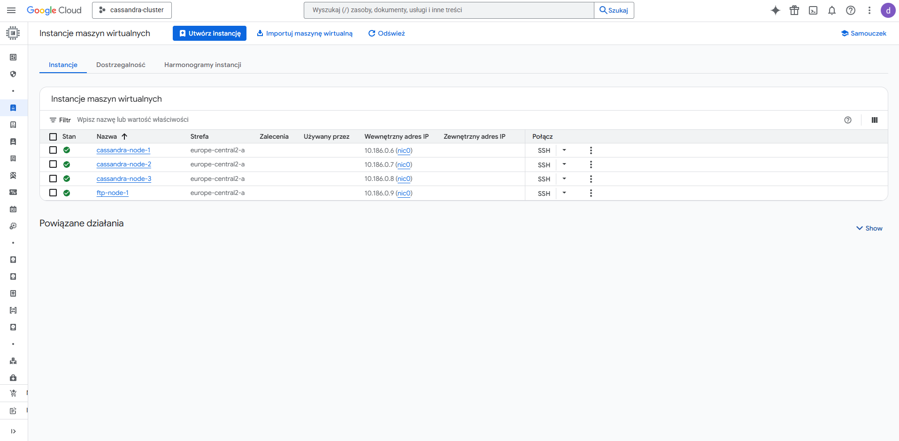

# Projekt kompleksowej platformy do analizy jakości powietrza

## 1. Cel projektu

Projekt ten stanowi kompleksowe rozwiązanie do automatycznego gromadzenia, przetwarzania i analizowania danych o jakości powietrza. Wykorzystuje architekturę opartą o chmurę publiczną (GCP) oraz narzędzia do automatyzacji (Ansible) i zarządzania zadaniami (cron). Sercem systemu jest rozproszona, wysoce dostępna baza danych Apache Cassandra, zasilana przez potok ETL oparty o PySpark.

## 2. Architektura i komponenty

Platforma składa się z dwóch głównych modułów:

-   **Infrastruktura jako kod (IaC)**: Zdefiniowana w katalogu `infrastructure/`, wykorzystuje Ansible do w pełni zautomatyzowanego provisioningu i konfiguracji całego środowiska w chmurze Google Cloud Platform (GCP). Obejmuje to tworzenie sieci, maszyn wirtualnych oraz instalację i konfigurację klastra Cassandra.
-   **Potok ETL**: Znajdujący się w katalogu `etl/`, jest odpowiedzialny za cykliczne pobieranie danych z zewnętrznego API (OpenAQ), ich przetwarzanie, czyszczenie i ładowanie do bazy danych. Proces ten jest obecnie zarządzany przez zadania cron.

## 3. Schemat działania

1.  **Provisioning Infrastruktury**: Administrator uruchamia playbooki Ansible, które automatycznie tworzą i konfigurują całe środowisko w GCP, w tym klaster Cassandra gotowy do pracy.
2.  **Orkiestracja zadań ETL**: Cykliczne uruchamianie zadań ETL jest obecnie realizowane za pomocą zadań cron, konfigurowanych na dedykowanej maszynie (host ETL).
3.  **Pobieranie danych**: Pierwszy skrypt ETL (`get_data.py`) łączy się z API OpenAQ, pobiera nowe dane pomiarowe dla zdefiniowanych lokalizacji i zapisuje je w surowej formie w bazie Cassandra.
4.  **Agregacja i czyszczenie danych**: Drugi skrypt ETL (`agregation.py`), wykorzystujący moc obliczeniową PySpark, przetwarza surowe dane, usuwa wartości odstające i oblicza średnie dzienne.
5.  **Wizualizacja i raportowanie**: Skrypt `data_visualization.ipynb` generuje raporty i wizualizacje na podstawie zagregowanych danych, które mogą być następnie udostępniane użytkownikom.

## 4. Technologie

-   **Chmura**: Google Cloud Platform (GCP)
-   **Automatyzacja**: Ansible
-   **Baza danych**: Apache Cassandra
-   **Przetwarzanie danych**: Python, PySpark, Pandas
-   **Orkiestracja**: Cron (z planami na Apache Airflow)

## 5. Jak zacząć?

Szczegółowe instrukcje dotyczące uruchamiania poszczególnych komponentów znajdują się w plikach `README.md` w odpowiednich katalogach:

-   [Instrukcje dotyczące infrastruktury](./infrastructure/README.md)
-   [Instrukcje dotyczące potoku ETL](./etl/README.md)
